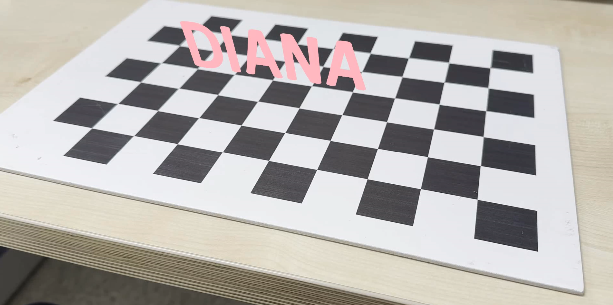
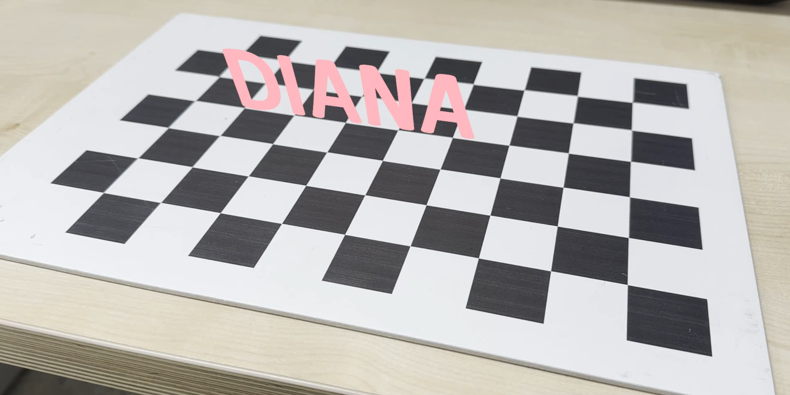
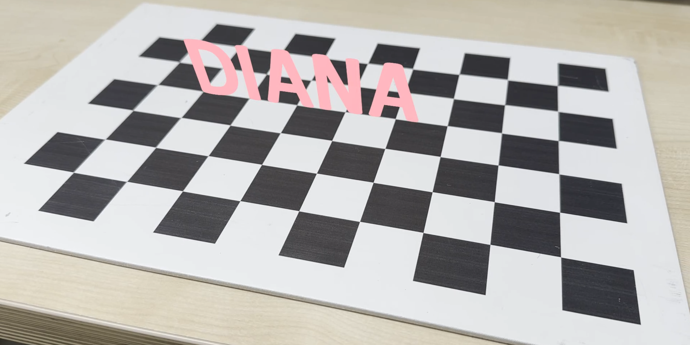

# Camera Pose Estimation and AR Overlay

Estimate camera pose using OpenCV and project a virtual object (e.g., text) onto a real-world scene with a chessboard.  
This project overlays a 2D graphic onto a planar surface using pose estimation results from camera calibration.

## Features

- Camera pose estimation using OpenCV (`solvePnP`)
- Augmented reality overlay onto a printed chessboard
- Video frame processing with smooth virtual text projection
- Supports transparent PNG input for overlay

## Demo Result

📌 The virtual object ("DIANA") is overlaid on the chessboard surface as if it were standing upright in 3D space.

| Frame 1 | Frame 2 | Frame 3 |
|--------|--------|--------|
|  |  |  |

## Requirements

- Python 3.8+
- OpenCV (`opencv-python`, `opencv-contrib-python`)
- Numpy

Install dependencies:

```bash
pip install opencv-python opencv-contrib-python numpy
```

## How to Run

1. Calibrate your camera (see `calibration_result.npz`).
2. Record a video with a printed chessboard (e.g., `chessboard_video.mp4`).
3. Place your overlay image (e.g., `diana.png`) with alpha channel.
4. Run the script:

```bash
python3 pose_estimation_ar.py
```

## Output

- Saves `output_ar_result.mp4` with the AR effect applied frame-by-frame.

